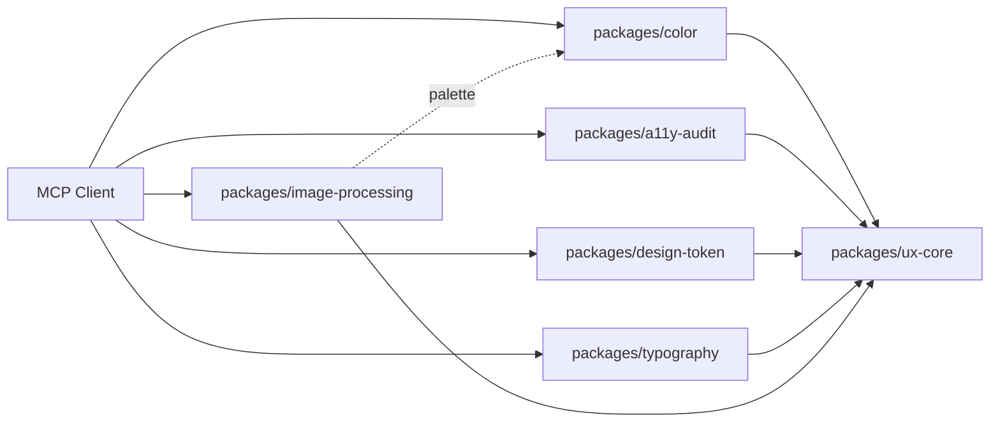

# Standard Beagle Tools

AI coding agent toolkit and UX MCP package monorepo — Claude Code plugins, MCP servers, and reusable npm packages for design, accessibility, and frontend tooling.

## Plugins (Claude Code marketplace)

This marketplace ships a growing collection of plugins for Claude Code. The core development trio:

| Plugin | Description | Version | Category |
|--------|-------------|---------|----------|
| **agnt** | Browser superpowers for AI coding agents: dev-server + reverse proxy, live error/incident inbox, quality audits, visual regression, and sketch/design modes | 0.10.1 | development |
| **lci** | Lightning Code Index: sub-millisecond semantic code search and call-hierarchy intelligence | 0.6.1 | development |
| **tools** | Complete toolkit combining agnt and lci | 1.0.0 | development |
| **mcp-architect** | Design high-quality MCP servers with progressive discovery and token efficiency | 0.1.0 | development |
| **mcp-tester** | MCP server testing and debugging with mcp-debug | 0.2.0 | development |
| **slop-mcp** | SLOP integration for MCP management and orchestration | 0.2.0 | development |
| **slop-coder** | SLOP language coding assistant and reference | 0.1.0 | development |
| **dartai** | Dart task management with adversarial cooperation loops | 0.3.0 | development |
| **workflow** | General-purpose adversarial workflow automation | 0.1.0 | development |
| **figma-query** | Token-efficient Figma integration with design library extraction | 0.1.0 | design |
| **ux-design** | UX design principles, color theory, typography, and accessibility | 0.1.0 | design |
| **ux-developer** | UX-driven development with WCAG 2.2 and usability best practices | 0.1.0 | development |
| **prompt-engineer** | State-of-the-art prompt and context engineering for 2026 | 0.1.0 | ai |

## Packages (npm `@standardbeagle/*`)

This monorepo also publishes six npm packages under `packages/` — UX-focused MCP servers and shared libraries:

| Package | Version | Description |
|---------|---------|-------------|
| [`@standardbeagle/ux-core`](./packages/ux-core/README.md) |  | Shared types, validators, k-means clustering |
| [`@standardbeagle/color`](./packages/color/README.md) |  | Color tools — contrast, palette generation, accessibility |
| [`@standardbeagle/a11y-audit`](./packages/a11y-audit/README.md) |  | Accessibility audit MCP server (axe-core, WCAG 2.2) |
| [`@standardbeagle/design-token`](./packages/design-token/README.md) |  | DTCG design tokens — validate, transform, generate |
| [`@standardbeagle/typography`](./packages/typography/README.md) |  | Typography tools — modular scale, font pairing |
| [`@standardbeagle/image-processing`](./packages/image-processing/README.md) |  | Image tools — sharp, blurhash, svgo |

### Architecture



Each MCP server package exposes tools to MCP clients (Claude Code, Cursor, etc.) and depends on `ux-core` for shared utilities. The `image-processing` package optionally calls into `color` for palette extraction.

## Installation

### Step 1: Install the binaries

```bash
# Via npm (recommended)
npm install -g @standardbeagle/agnt @standardbeagle/lci

# Via pip
pip install agnt lightning-code-index

# Via Go (lci only)
go install github.com/standardbeagle/lci/cmd/lci@latest
```

### Step 2: Register MCP servers

**Option A: Via slop-mcp** (recommended if available)
```
mcp__plugin_slop-mcp_slop-mcp__manage_mcps
{ "action": "register", "name": "agnt", "command": "npx", "args": ["-y", "@standardbeagle/agnt", "mcp"], "scope": "user" }
{ "action": "register", "name": "lci", "command": "npx", "args": ["-y", "@standardbeagle/lci", "mcp"], "scope": "user" }
```

**Option B: Add to `.mcp.json`**
```json
{
  "agnt": {
    "command": "npx",
    "args": ["-y", "@standardbeagle/agnt", "mcp"]
  },
  "lci": {
    "command": "npx",
    "args": ["-y", "@standardbeagle/lci", "mcp"]
  }
}
```

### Step 3 (Optional): Install Claude Code plugins

The plugins provide commands, skills, and agents that help you use the MCP tools:

```bash
# Install the complete toolkit (recommended)
claude plugin add tools@standardbeagle-tools

# Or install individual plugins
claude plugin add agnt@standardbeagle-tools
claude plugin add lci@standardbeagle-tools
```

## Plugin Details

### agnt - Browser Superpowers

Give your AI coding agent browser superpowers — it sees what your app does, not just the code:

- **Process Management**: Run and manage dev servers with output capture and clean shutdown
- **Reverse Proxy**: HTTP traffic logging with automatic frontend instrumentation
- **Browser Debugging**: 50+ diagnostic functions (`__devtool` API)
- **Incident Inbox**: Deduped, priority-ordered error stream (`get_incidents`) so the agent acts on signal, not noise
- **Quality Audits**: Accessibility, performance, security, SEO, responsive, API efficiency, and loading-UX
- **Visual Regression**: Baseline/compare screenshots (`snapshot`)
- **Replay Testing**: Record → worker-mock → replay front-end tests (`replaytest`, Pro)
- **Tunnels**: Expose a local proxy via Cloudflare or ngrok for mobile testing
- **Sketch & Design Mode**: Wireframe on the live UI and iterate on designs with the agent

**Requirements**: `agnt` binary via npm/pip or [GitHub releases](https://github.com/standardbeagle/agnt)

### lci - Lightning Code Index

Sub-millisecond semantic code search and code intelligence:

- **Instant Search**: Find code patterns across any codebase in <5ms
- **Symbol Lookup**: Definitions, references, and implementations
- **Call Hierarchy**: Trace function calls up and down
- **Codebase Overview**: 79.8% context reduction for efficient analysis
- **Context Manifests**: Save/load code context for agent handoff
- **Side Effect Analysis**: Function purity and mutation tracking

**Requirements**: `lci` binary via npm/pip/go or [GitHub releases](https://github.com/standardbeagle/lci)

### tools - Complete Toolkit

Best of both worlds - combines agnt and lci for the ultimate AI coding experience.

**Requirements**: Both `agnt` and `lci` binaries

## Repository Structure

```
standardbeagle-tools/
├── .claude-plugin/
│   └── marketplace.json      # Marketplace registry
├── plugins/
│   ├── agnt/                 # Browser superpowers plugin
│   │   ├── .claude-plugin/
│   │   ├── commands/
│   │   ├── skills/
│   │   ├── agents/
│   │   └── mcp.json.disabled
│   ├── lci/                  # Code intelligence plugin
│   │   ├── .claude-plugin/
│   │   ├── commands/
│   │   ├── skills/
│   │   └── mcp.json.disabled
│   └── tools/                # Combined plugin
│       ├── .claude-plugin/
│       ├── commands/
│       ├── agents/
│       └── mcp.json.disabled
└── README.md
```

Note: The `mcp.json.disabled` files contain example configurations. MCP servers should be registered via slop-mcp or your personal `.mcp.json` to avoid duplicate registrations.

## Development

### Monorepo Setup (pnpm packages)

The `packages/` directory is a [pnpm workspace](https://pnpm.io/workspaces). On a fresh clone:

```bash
pnpm install          # install all workspace deps
pnpm -r build         # build every package
pnpm -r test          # run vitest across all packages
pnpm smoke            # E2E smoke test (1 tool per MCP server)
pnpm lint             # lint all packages
```

### Release flow (Changesets)

```bash
pnpm changeset            # describe changes (interactive)
pnpm changeset version    # bump versions + update CHANGELOG
git push                  # release.yml workflow handles npm publish
```

### Plugin Local Development Setup

After cloning, run the setup script to configure git filters for local development:

```bash
./scripts/setup-dev.sh
```

This configures git smudge/clean filters so that:
- **Locally**: `mcp.json` files use local binaries (`agnt`, `lci`)
- **In commits**: `mcp.json` files use npx commands for deployment

The filters are stored in your local git config. If you clone fresh, re-run the setup script.

### Testing Plugins Locally

```bash
# Add marketplace from local directory
claude plugin add-dir /path/to/standardbeagle-tools

# Or test individual plugin
claude plugin add agnt --source ./plugins/agnt
```

### Publishing

Plugins are published via the Claude Code marketplace. The `marketplace.json` defines all available plugins and their metadata.

### Release Setup

This monorepo uses [Changesets](https://github.com/changesets/changesets) for version management and release automation.

**Required secret:**
- `NPM_TOKEN` — npm authentication token for publishing packages. Add this in **Settings > Secrets and variables > Actions** in the GitHub repository.

**Workflow:**
1. Run `pnpm changeset` to create a changeset describing your changes
2. Commit the changeset file (`.changeset/*.md`)
3. On merge to `main`, the release workflow creates a Version Packages PR
4. Merging the Version Packages PR publishes updated packages to npm

## Contributing

See [CONTRIBUTING.md](./CONTRIBUTING.md) (forthcoming) for contribution guidelines, or open a pull request against `main` for review.

## License

MIT

## Author

[Standard Beagle](https://github.com/standardbeagle)
