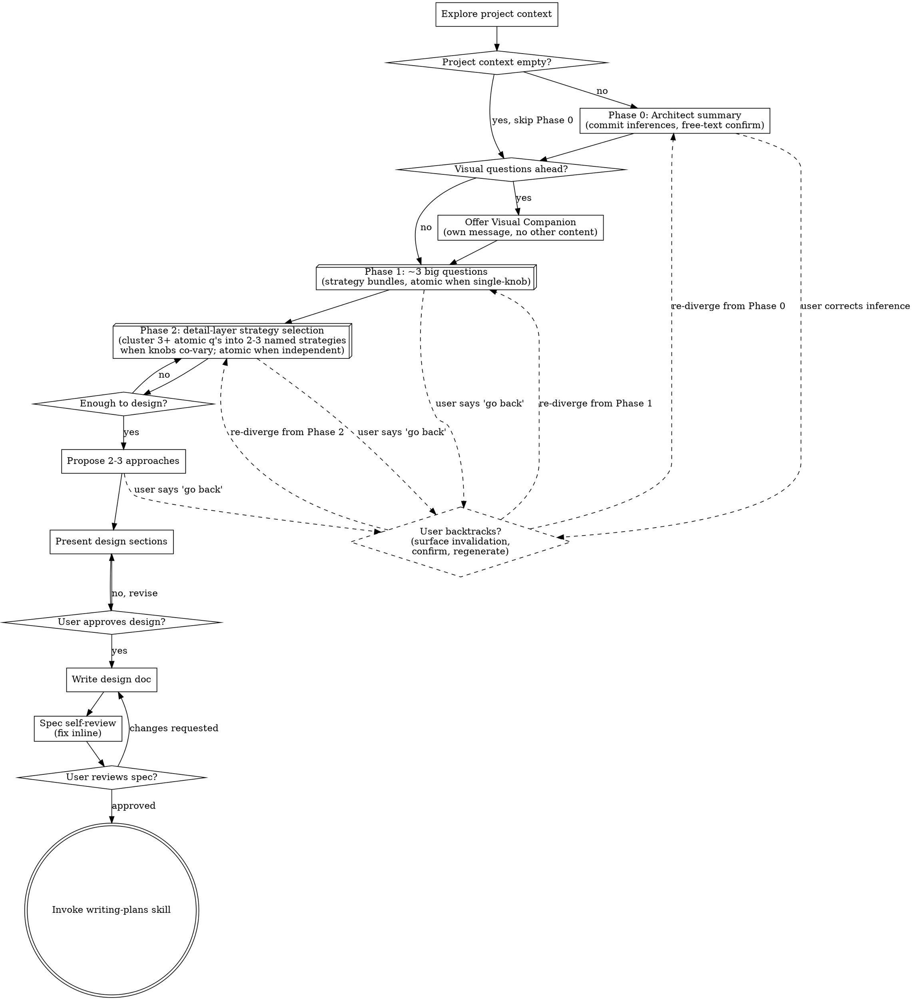

<!--
Originally ported from superpowers (`skills/brainstorming/`).
Upstream: https://github.com/obra/superpowers — MIT License.
Body and reference files preserved verbatim; only frontmatter normalized
per standardbeagle-tools R1 §2.2 (bilingual Use when/Skip when triggers).

S3 spike adds a `cards` screen type to the visual companion at
`./companion/`. The cards extension lets Claude author markdown screens
with `kind: cards` for divergent-thinking card-sort flows. See the
companion's `docs/screen-format.md` for the full schema reference;
the `cards` kind is documented under I4 follow-up.
-->

# Brainstorming Ideas Into Designs

助化念為成設計與 spec，經自然協對話。

先明 project 當 context，後批問以精煉念。明所建後，呈設計，取 user 許。

<HARD-GATE>
於呈設計且 user 許前，勿呼任何實作 skill、勿書任何 code、勿 scaffold 任何 project、勿行任何實作之舉。此適於**每** project，無論其似簡。
</HARD-GATE>

## Anti-Pattern: "This Is Too Simple To Need A Design"

每 project 遵此程。To-do 列、單函工具、config 變——皆然。「簡」project 即未察假設生最多廢工之所。設計可短（真簡者數句即可），然汝**必**呈之並取許。

## Anti-Pattern: "Reflexive Question Batching"

別於上條。前者乃跳過設計；此者乃反射性堆問。於 user 大半 context 已可自 codebase / memory / prompt / git log 推斷時，仍硬批 4 問之 `AskUserQuestion`——此乃廢工之另形：問汝本可推之事，問互可束之事，問 user 已默述之事。徵兆：問題清單寫好後**未**自察「Phase 0 摘要可否吸收此問？」「3 題在同一 sub-domain，可否束為 strategy bundle？」「此題答案可自既有檔推得?」逕直發送。

對策：問前一頓——對照下面之 `<QUESTION-BUDGET-GUIDANCE>` 自察。問題未必減，但須**經審**而非反射。

<QUESTION-BUDGET-GUIDANCE>
**為偏好（preference），非硬界（cap）。**

汝之問題預算為一**典型形 landmark**，非 limit / cap / max。意在於汝之反射性堆問前置一頓自察，非斷汝之問。

**Typical-case landmark：**

- **Phase 0 architect summary**：自由文，**不計數**。摘要本質為 Claude 之單則推斷呈現，非問。
- **Phase 1 big strategy-bundle questions**：`~3 typical`。多數 project 三 big question（shape / approach / constraint 之類）即足切大分支。
- **Phase 2 detail-layer strategy/atomic questions**：`~2 typical`。Phase 1 已收窄空間後，Phase 2 之細項通常一兩束 strategy 或一兩個原子 knob 即可收尾。
- **總計 landmark ~5**：Phase 1 加 Phase 2，~5 為 typical 形之地標。**非 cap。** Project 確需更多原子 q 時（見下 allowlist），照當問。

**接近 landmark 時之自察（3 introspection q's）：**

當汝預備之問題群將令本 session 累計問題數靠近或越過 ~5 時，先停一拍，於汝 own context 中自答此三問：

1. **Could a strategy bundle absorb some of these?** ——預備之問題群中是否 3+ 題群於同一 sub-domain 且 knob 連動？若是，束之而非逐一原子問。
2. **Would Phase 0 inference cover any?** ——彼批問題中是否有可自 codebase / memory / prompt / git log 推得者？若是，先以 Phase 0 推斷呈，user 確認方略當問。
3. **Is this genuinely a checklist of independent decisions?** ——彼批問題是否為下面 allowlist 所列之合法重問場景（config 矩陣、合規清單、brownfield 審計、多方需求收集）？若是，當問即當問。

**三答俱「是，必要且原子」→ continue asking。** 此自察非 gate，非阻汝之問；乃確保問為經審之問。

**合法重問場景（allowlist）：**

下列 case 確當期望問題數超 ~5 landmark，**勿**反硬限：

- **Long config matrices**：CI/CD 多環境變數、feature flag 矩陣、build target 組合——數十獨立 knob 須各定，無 strategy 可束
- **Regulatory checklists**：HIPAA / GDPR / SOC2 合規條目逐項確認——每條為獨立 yes/no 法律事實，不可推斷亦不可束
- **Brownfield audits with many independent unknowns**：陌生 legacy codebase 之初探，10+ 獨立疑點待 user 釐——Phase 0 推斷無足信號，須逐項問
- **Multi-stakeholder requirement gathering**：多方利益關係人各持不同需求 / 限制——須逐方逐關注點原子收集，不可代為合併

此清單為示例非窮舉。判定原則：問是否真為獨立、不可推斷、不可束之 atomic decision？是則當問。
</QUESTION-BUDGET-GUIDANCE>

## Checklist

汝必為下每項立 task 並依序竟：

1. **Explore project context** — 察檔、docs、近 commit
2. **Commit architect summary (Phase 0)** — 呈當前推斷之 1-頁摘要並請 user 確認或更正；當 project context 確空時可跳。見下 Phase 0 節。
3. **Offer visual companion**（若議涉視覺）— 為獨訊，勿合於問。見下 Visual Companion 節。
4. **Phase 1 — ask big strategy-bundle questions** — 默以 ~3 big questions 開（每 option 為策略束，連動數個下游 knob，依下節 schema）；Phase 0 低信度條目為首批問題候選；單旋鈕之問仍可原子；迭至足以設計
5. **Phase 2 — strategy-selection on detail layer** — 讀 Phase 1 答後，於各擇定之大分支下察當問之細項；若 3+ atomic 問題群於同一 sub-domain 且 knob 連動，宜束為 2–3 named strategies；確獨立之 knob 仍以原子問。見下 Phase 2 節。
6. **Question-budget self-check at ~5 landmark** — 累計問題（Phase 1 + Phase 2）靠近或越 ~5 typical landmark 時，跑上節 `<QUESTION-BUDGET-GUIDANCE>` 之 3 introspection 自察；allowlist 之合法重問場景（config 矩陣、合規清單、brownfield 審計、多方需求）適用時照當問。**此非 gate，乃自察。**
7. **Propose 2-3 approaches** — 附權衡與汝薦
8. **Honor backtrack — surface invalidation, then regenerate** — User 隨時可說「回 Phase X 重議」；汝**先**列下游將失效之擇、徵其同意，**後**自該層重 diverge。見下 Diverge / Converge 節。
9. **Present design** — 按複雜度縮放分節，每節後取許
10. **Write design doc** — 存於 `docs/superpowers/specs/YYYY-MM-DD-<topic>-design.md` 並 commit
11. **Spec self-review** — inline 速察 placeholder、矛盾、模糊、scope（見下）
12. **User reviews written spec** — 請 user 審 spec 檔後再進
13. **Transition to implementation** — 呼 writing-plans skill 以造實作計劃

## Process Flow



**終態即呼 writing-plans。** 勿呼 frontend-design、mcp-builder、或其他實作 skill。Brainstorming 後**唯一**呼之 skill 即 writing-plans。

## Phase 0: Architect Summary (Commit Inferences First)

於批問澄清前，先呈一頁 architect/manager 摘要，公開汝當前推斷。多數時 codebase + memory + 初始 prompt + git log 已供大半 context；先盲問徒耗 round trip。Phase 0 將汝之假設落於文字，user 一覽即可確認或更正——通常一輪自由文字回覆即可。

### Schema

汝呈之摘要應含下列各項，每項標 confidence（high/med/low）：

- **Inferred goal** — 一句概述汝認 user 欲達者
- **Inferred constraints** — 三條（含技術、時間、人力、相容性等任意組合）
- **Inferred system shape** — 架構草圖（數行文字或簡 ASCII，非完整設計）
- **Risk surface** — 汝預見前三大風險或不明處
- **Alternative framings** — 兩條「此亦可框為 X」之另類解讀，助 user 察汝是否誤鎖框架
- **Confidence per inference** — 各條註 high/med/low

### Mechanics

- **來源**：codebase 探察 + project memory（CLAUDE.md、`.dartai/`、`docs/`）+ 初始 prompt + 近期 `git log`
- **呈現格式**：單則訊息，markdown 列表，非 `AskUserQuestion`。User 以自由文字回覆——確認、更正、或補述
- **Low-confidence 條目** → 成 Phase 1 澄清問之首批候選（即「我不確之處，正當問」）
- **High-confidence 條目** → 通常可略相應澄清問；user 反對方需追問
- **跳過條件**：當 project context 真空（greenfield 目錄 + 無 memory 檔 + prompt 僅一兩句模糊描述）時，跳過 Phase 0 直入澄清問——彼時無足夠信號可推斷，硬呈摘要徒造幻覺
- **Escape valve**：若 user 反饋「全錯，重來」，視為信號汝 context 不足，回 Phase 1 從頭問澄清；勿頑守原摘要
- **Backtrack 回 Phase 0**：Phase 0 推斷亦可作 converge 層處之——後續任何時點 user 更正 Phase 0 之原推斷（如：「我先前說 monolith，其實該是 service」），依下 Diverge / Converge 節之法處：列下游將失效之 Phase 1/2 擇、徵同意、自 Phase 0 重 diverge

### 範例（縮略）

> **Architect summary（請確認或更正）**
>
> - **Goal**（high）：為 X 服務增 OAuth 登入
> - **Constraints**（med）：
>   - 須相容既有 session middleware
>   - 偏 hosted provider（Auth0/Clerk）勝自建
>   - 兩週內可上線
> - **System shape**（med）：Express 中介層 + 既 user 表新增 `oauth_provider` 欄
> - **Risks**（low–med）：既 session 與 OAuth callback 之衝突；migration 對既 user 之影響；provider 鎖定
> - **Alternative framings**：（a）此亦可框為「換掉 session 系統」之大重構；（b）此亦可僅為 SSO 對接內網，無公網需求
>
> 何處需更正？

如此 user 一則文字回覆即可校準汝整 context，後續 `AskUserQuestion` 批次得以針對真有不明之處，而非泛泛開場。

## Asking Questions with AskUserQuestion

用 `AskUserQuestion` tool 於所有澄清問。Tool 支 1–4 問 per call——**常批盡可能多相關問**以減 round trip。

### Batching Rules

```
ALWAYS batch questions that:
  - Can be answered independently (answers don't depend on each other)
  - Cover different dimensions of the design (scope, style, constraints, deployment)
  - Are all needed before you can make progress

DO NOT batch questions where:
  - Answer to question A determines whether question B is relevant
  - The user's answer to one question would reframe all the others
  - A question is a follow-up to something just said

Target: 2-4 questions per call. A single question is acceptable only when
it's a genuine decision point that gates everything else.
```

### Question Design

每問應有 2–4 structured option 附述。「Other」恆自加——汝不須含之。答空或未全涵時用之。

#### Strategy-bundle vs atomic — when each shape fits

Phase 1 之高層問題，**preferred shape 為 strategy bundle**：每 option 不只一資料點，而為一束相關下游選擇之打包，user 一擇即連動數個 knob。但非每問皆宜 bundle——下決策規則：

```
Prefer strategy bundle when:
  - 3+ downstream knobs cluster together under each option (auth choice
    drags session model, migration shape, and provider lock-in along)
  - Options represent meaningfully different architectures or stances,
    not just different values of the same parameter
  - User picking option A vs B genuinely cuts the design tree, not just
    fills a single field

Default to atomic question when:
  - It's a genuine single-knob decision (port number, package name,
    color hex, file path)
  - The downstream impact is local — picking one value vs another
    doesn't change other decisions
  - The dimension is orthogonal to architecture (a polish / config knob)

When in doubt: ask "if user picks differently here, do 3+ other questions
become moot or reshape?" If yes, bundle. If no, atomic is fine.
```

不可硬套 bundle 於本應原子之問——強塞 bundle 於 port-number 類問題只造混淆。Bundle 為高層架構/scope/方法選擇之 default shape；原子為細節旋鈕之 default shape。

#### Strategy-option schema (when bundling applies)

當問題確宜 bundle 時，每 option 應含下列欄位（皆 optional 但鼓勵填寫）：

- **label**（必）：一行可讀標籤
- **bundles_resolves**：此選擇自動定下之下游 knob 列表（讓 user 一覽即知此擇所連動者）
- **unlocks**：此擇所獲之能力 / 路徑
- **locks_out**：此擇所封閉之能力 / 路徑（與 unlocks 對稱，使 trade-off 顯）
- **seen_in**：prior art / 既有 repo / 既有 pattern 引用（provenance）—— 助 user 判此非空想
- **reconsider_when**：重審此擇之 trigger 條件（規模到 X、團隊變 Y、需求新增 Z）
- **recommendation_confidence**：high/med/low —— Claude 之 pre-vote，使 user 知汝偏好強度

欄位不必每條皆填——Phase 0 已知者可簡寫，Phase 0 不知者填全。`seen_in` 尤要：option 若無 prior art，記為「novel — no direct analogue」而非偽造。

#### Worked example — strategy-bundle question

```yaml
question: "How should auth integrate with the existing app?"
# This is a bundle question: each option drags 4-6 downstream decisions.

options:
  - label: "Hosted provider (Auth0/Clerk)"
    bundles_resolves:
      - session model (provider-managed JWT)
      - user-table migration (add oauth_provider + sub columns)
      - logout/refresh semantics (provider SDK handles)
      - billing model (per-MAU subscription)
    unlocks:
      - SSO, MFA, social login out of the box
      - faster delivery (~days not weeks)
      - SOC2 trail from provider
    locks_out:
      - full control of session token shape
      - on-prem / air-gapped deploy
    seen_in: "internal /billing service uses Clerk; team familiar"
    reconsider_when:
      - MAU exceeds provider free tier breakpoint
      - compliance requires data residency
    recommendation_confidence: high

  - label: "Self-hosted (Keycloak / Ory)"
    bundles_resolves:
      - session model (own JWT, own rotation)
      - user-table migration (full identity schema)
      - ops surface (one more service to run + back up)
      - billing model (infra cost only)
    unlocks:
      - data residency control
      - custom token claims, custom flows
    locks_out:
      - "deliver in 2 weeks" timeline (likely)
    seen_in: "no prior use in this codebase"
    reconsider_when:
      - hosted provider price ceiling hit
      - regulatory residency requirement appears
    recommendation_confidence: med

  - label: "Roll our own on existing session middleware"
    bundles_resolves:
      - session model (extend current middleware)
      - user-table migration (minimal — add provider + sub)
      - logout/refresh semantics (write ourselves)
    unlocks:
      - zero new dependencies
    locks_out:
      - SOC2 / compliance evidence (now ours to produce)
      - MFA, social login (build each)
    seen_in: "current session middleware is custom; pattern matches"
    reconsider_when:
      - second OAuth provider needed
      - any compliance deadline
    recommendation_confidence: low
```

對比 — **atomic question**（單旋鈕，不應 bundle）：

```yaml
question: "What port should the dev server bind to?"
options:
  - label: "3000"   description: "Default for many JS dev servers"
  - label: "5173"   description: "Vite default"
  - label: "8080"   description: "Common alt for backend"
# No bundles_resolves / unlocks / locks_out — picking 3000 vs 5173 doesn't
# reshape the design. This is a config knob, atomic is correct.
```

#### Other useful question shapes

```
Good use of multiSelect (orthogonal capabilities, not strategies):
  question: "Which external services does this integrate with?"
  multiSelect: true
  options:
    - label: "Auth provider"     description: "OAuth, Auth0, Clerk"
    - label: "Payment gateway"   description: "Stripe, Paddle"
    - label: "Email service"     description: "SendGrid, Postmark, SES"
    - label: "Storage"           description: "S3, GCS, Cloudflare R2"

Good use of preview (visual/layout choices — atomic with picture):
  question: "Which dashboard layout fits your workflow?"
  options:
    - label: "Sidebar nav"   preview: "┌──┬────────┐\n│  │        │\n│  │        │\n└──┴────────┘"
    - label: "Top nav"       preview: "┌────────────┐\n├────────────┤\n│            │\n└────────────┘"

Bad — open-ended with no options (use free text via Other instead):
  question: "What do you want to build?"   ← ask this as text, not AskUserQuestion
```

### Phase 1: First Question Batch — strategy-bundle big questions

**Inputs to Phase 1**：Phase 0 之 architect summary 之 **low-confidence 條目**為首批 Phase 1 問題之候選來源（high-confidence 者通常可略，待 user 反對方追問）。Phase 0 跳過時，Phase 1 從此處的標準開場開始。

**Default shape：strategy-bundle big questions**。不再以原子資料點（「what's your deployment target」「what's your primary constraint」）逐一探，而以 **~3 big questions** 為目標，每問之 options 為一束策略——每擇連動下游數個 knob，依上節 schema。Aim for ~3 big questions in typical cases——此為 typical landmark, 非 cap；project 確有更多獨立高層分支時 4-5 亦可，依上節 `<QUESTION-BUDGET-GUIDANCE>` 之 allowlist 判定。

#### Standard opening — strategy-bundle template

多數 project，以此類 ~3 big questions 開（具體 option 視 Phase 0 推斷而調，下為骨架）：

```
1. SHAPE — "How should this fit into the existing system?"
   (Strategy bundle: each option resolves architecture, integration
    surface, deploy unit, data ownership.)
   options (illustrative — adapt to project):
     - "Standalone service / new repo"
       bundles_resolves: own deploy, own data store, REST/RPC boundary
       unlocks: independent release cadence
       locks_out: shared transactions with main app
       seen_in: <prior service in this codebase, if any>
       recommendation_confidence: <claude's vote>
     - "Embedded module in existing app"
       bundles_resolves: shared deploy, shared db, in-process calls
       unlocks: easy transactions, simpler ops
       locks_out: independent scaling
     - "Plugin / extension to existing platform"
       bundles_resolves: piggyback on host's auth / data / ops
       unlocks: zero new infra
       locks_out: bound to host's release cycle

2. APPROACH — "Which delivery strategy fits the constraints?"
   (Strategy bundle: each option resolves scope cut, who-builds-what,
    risk surface, time-to-first-demo.)
   options (illustrative):
     - "MVP slice end-to-end, then deepen"
     - "Build foundation first, feature flag the user-facing part"
     - "Spike + throw-away, then rebuild informed"

3. CONSTRAINT — "Which constraint dominates?"
   (Often atomic-feeling but actually a strategy bundle: 'speed' vs
    'maintainability' vs 'perf' bundles different code-quality bars,
    different test depth, different review intensity.)
     - "Ship fast, accept tech debt to revisit"
     - "Maintainability first, slower delivery OK"
     - "Performance / scale, willing to invest upfront"
```

User picks 1 option per big question → ~3 picks resolve 9-15 downstream decisions in one round → Phase 2 (strategy-selection-on-detail) can then drill into the picks atomically.

#### Atomic-question escape valve

某些開場問題確為單旋鈕（語言 / runtime 已定、目標平台無懸念、port 號之類）——彼時直接以原子問即可，勿硬塞 bundle schema。判別仍依上節 decision rule：「若 user 改答此問，3+ 其他問題會否 moot 或重塑？」否則原子可矣。

#### After the first batch

讀答後，進 Phase 2（strategy-selection-on-detail，見下節）以細化各擇定大分支下之 knob。通 2 輪批問即足（Phase 1 + Phase 2）；3 乃極限於呈法前。

#### When the project has more high-level branches

「~3 big questions」為 typical case 之軟目標，非硬限。Project 確跨數獨立子系統時（chat + storage + billing 混合 platform），先以「scope splitter」big question 切 sub-project（見 The Process > 探法），再對各 sub-project 各跑 ~3 big questions。勿為守 3 之數而硬塞跨領域 option 入單問。

### Phase 2: Detail-layer strategy selection

**Inputs to Phase 2**：Phase 1 之答（user 已擇定之 ~3 big-question option）。各擇定大分支下，會自然湧現一批細 knob 待定——cache TTL、eviction 法、retry 次、deploy 區。Phase 2 之事即察彼批細 knob 之**結構**：彼為連動之策略簇？或為獨立 config 之 checklist？

**典型 landmark：~2 questions**。多數 project 經 Phase 1 收窄空間後，Phase 2 一兩束 strategy 或一兩個獨立 atomic knob 即可收尾，與 Phase 1 之 ~3 合計 ~5 為 typical 形之地標。確需更多原子 q 時——allowlist 場景（config 矩陣、合規清單、brownfield 審計、多方需求）——照當問即可，**此為 landmark, 非 cap**。詳見上節 `<QUESTION-BUDGET-GUIDANCE>` 之自察與 allowlist。

#### Cluster-detection heuristic（決策規則）

問前，列汝預備提之細項問題清單（即便僅心列）。若見 3+ 問題群於同一 sub-domain（caching、auth、deployment、retry、error handling 等），勿即逐一原子問——先察彼是否合一 strategy bundle。

```
Prefer 2-3 named strategies when:
  - 3+ atomic questions cluster in the same sub-domain
    (e.g., caching: TTL + eviction + key shape + invalidation + warm-up)
  - Knobs co-vary: picking one value naturally implies others
    (read-through cache → tag-based invalidation; write-through → explicit hooks)
  - "Consistent siblings" exist — the answers hang together as a coherent
    architectural stance, not arbitrary independent values

Atomic questions are appropriate when:
  - Knobs are genuinely independent — picking one value doesn't constrain
    the others (port number + log directory + max-retries integer)
  - The cluster is a checklist of unrelated config (no co-variance)
  - The decisions are simple value selections with no architectural payload
  - User explicitly wants to specify each knob individually
    (escape valve — see "User override" below)

Trigger to re-evaluate: count atomic questions you're about to ask in the
same sub-domain. 3+ → consider bundling. <3 → atomic is fine. The "3+"
threshold is a soft prompt to check, not a hard rule.
```

「Sub-domain 群聚」之判別應具體（哪幾題、屬何主題、為何 knob 連動），非泛指「感覺相關」。若無法明指 3+ 題且無法述其連動關係，彼批應留為原子。

#### When atomic data q is appropriate（顯白 allowlist）

下列場景**確**應原子問，勿硬塞 strategy bundle：

- **Independent config values**：port、log path、timeout 秒數、max-retries 整數——彼間互不影響
- **Simple identifier picks**：package name、dartboard、env var name——只一字串待定
- **Polish / cosmetic knobs**：color hex、font size、icon set——皆獨立美學擇
- **Boolean toggles unrelated to architecture**：「啟 telemetry?」「啟 dev-mode banner?」——單旗，無下游連動
- **User-supplied data**：「用戶 email 欄位上限長度?」——非架構擇，僅資料約束

此清單為示例非窮舉。判定原則仍為「knob 是否與 sibling 連動」。

#### Worked examples

**Example 1 — Bundle applies（cache 簇）**

Phase 1 已擇「embedded module in existing app + maintainability-first constraint」。Phase 2 草擬之細項問題：

```
- "Cache TTL?" (30s / 5min / 1hr / 1day)
- "Eviction policy?" (LRU / LFU / TTL-only / manual)
- "Cache key shape?" (URL+headers / URL only / custom builder)
- "Invalidation strategy?" (TTL expiry / explicit purge / tag-based / event-driven)
- "Warm-up on deploy?" (yes / no / partial)
```

5 問群於 caching sub-domain，且 knob 連動（read-through 之 cache 自然要 tag-based invalidation；write-through 自然要 explicit hooks）。**宜束**為單問：

```yaml
question: "How should caching be structured?"
options:
  - label: "Read-through + TTL + tag-invalidation"
    bundles_resolves:
      - TTL ~5min default per resource type
      - LRU eviction within memory cap
      - key = URL + select request headers
      - invalidation = tag-based on write events
      - warm-up = top-N hot keys on deploy
    unlocks:
      - simple read path, low write coupling
      - granular invalidation for related-resource updates
    locks_out:
      - strict read-after-write consistency
    seen_in: "rails-style fragment cache pattern; redis tag-cache repos"
    recommendation_confidence: high

  - label: "Write-through + explicit-hooks"
    bundles_resolves:
      - TTL = effectively infinite (write keeps it fresh)
      - eviction = LRU on memory cap only
      - key = explicit per write site
      - invalidation = explicit purge on each write path
      - warm-up = N/A (writes populate)
    unlocks:
      - read-after-write consistency
    locks_out:
      - "drop-in cache layer" (every write site must know about cache)
    seen_in: "common in financial / inventory systems"
    recommendation_confidence: med

  - label: "No cache + DB-only"
    bundles_resolves:
      - all caching knobs = N/A
    unlocks:
      - simplest mental model, no staleness bugs
    locks_out:
      - sub-100ms response on hot reads at scale
    seen_in: "early-stage projects, low-traffic admin tools"
    recommendation_confidence: low
```

User 擇 1 option → 5 細項一次解。

**Example 2 — Atomic stays（獨立 config 簇）**

Phase 1 已擇「standalone service + ship-fast constraint」。Phase 2 草擬之細項問題：

```
- "What port should the service bind to?" (3000 / 5173 / 8080 / other)
- "Where should logs be written?" (./logs / /var/log/<svc> / stdout-only)
- "Default max-retries on outbound calls?" (1 / 3 / 5)
```

3 問皆無連動——port 之擇不涉 log 路徑，retries 數不涉 port。無 strategy bundle 可成（強束「port=3000 + log=stdout + retries=3」為「dev preset」、「port=8080 + log=/var/log + retries=5」為「prod preset」純屬牽強，且 user 可能要 dev 之 port 配 prod 之 log）。**保持原子**，三問同批以 `AskUserQuestion` 一次發送即可。

#### User pick mechanics + free-text override

當 Phase 2 用 strategy bundle 時：

- **User picks one strategy** → 該 strategy 之 `bundles_resolves` 全 knob 自動依 spec 落定，記入 design context
- **Free-text override on single knob**：user 雖擇 strategy A，仍可自由文字補述「但 TTL 給我用 1hr 而非 5min」——此為 escape valve，覆寫該單 knob，其餘從 strategy。**勿**將此視為 user 拒絕整 strategy；僅當 user 明示「全錯，重來」方回 Phase 1
- **User picks "Other"** → 視為 user 欲手調全部 knob；退回原子問各細項
- **Confidence reporting**：選定 strategy 後，於 design context 記錄哪些 knob 為 strategy 內定（high confidence）、哪些為 user 覆寫（user-explicit），以利後續 spec self-review 時辨

### When to Use Free Text

有問無界答集。彼時作純文問（非 `AskUserQuestion`），並於 structured 問旁或後：

- "What are the key domain concepts?" — 無界，以文問
- "Describe the current pain point" — context，以文問
- "Any other constraints I should know?" — 收尾，以文問

## Diverge / Converge as Recurring Shape

Phase 0、Phase 1、Phase 2、最後之「propose 2-3 approaches」**皆為同一形狀之實例**：Claude diverge（生 ~3 候選覆蓋當層決策空間之廣度），user converge（擇一以窄空間），下一層於受窄之空間內再 diverge。將此形狀顯白後，下面三事得以乾淨處置：

1. **層間之延續**：Phase 1 之擇決定 Phase 2 之問題形（embedded module 之擇令 Phase 2 問 in-process knob，不問 service-boundary knob）
2. **倒退之合法**：user 隨時可說「等等，回 Phase 1 重議」——此非例外，乃此形狀之原生功能
3. **Phase 0 之地位**：Phase 0 非「前 phase」，乃**第零層 converge**——汝之推斷即一 diverge，user 之確認 / 更正即 converge

### Pattern per layer

```
Layer N:
  diverge  → Claude generates ~3 candidate options spanning the breadth
              of the decision space at this layer
  converge → user picks one (or "Other"), narrowing the space
  carry    → pick is recorded with a backtrack_pointer to this layer
              (logical scratch-state, see Mechanics below)

Layer N+1:
  diverge happens within the constrained space the converge defined
  ...
```

每層 converge 之後，下一層之 diverge **僅展開**已選分支內之子空間——不再呈被該擇排除之選項。若 user 後悔，需經 backtrack 路徑重開該層。

### Mechanics

**Scratch state — not persistent**：Claude 無持久狀態。「decision tree」乃 session 內之 logical scratchpad——以 markdown 列表 / 短 yaml 於 context 中持，每收一 converge 即更新。形如：

```yaml
# Decision tree (logical scratchpad, kept in session context)
phase_0:
  goal: "OAuth login on existing app"  # confirmed by user
  shape: "monolith"                    # confirmed by user
phase_1:
  shape_pick: "embedded module in existing app"
  approach_pick: "MVP slice end-to-end"
  constraint_pick: "ship fast"
phase_2:
  caching_pick: "read-through + TTL + tag-invalidation"
```

汝**不必**將此 yaml 顯給 user 每輪——保於 context 即可。User 觸 backtrack 時方拿出對照「下游將失效者」清單。

**Backtrack flow**：

```
User: "wait, go back to Phase 1 — let's reconsider monolith"

Claude (do NOT silently regenerate):
  1. Inspect scratchpad → list which downstream picks depend on the
     Phase 1 'shape' choice
  2. Surface the invalidation explicitly:
     "Going back to Phase 1 'shape' will invalidate:
        - Phase 2 caching pick (read-through + TTL + tag-invalidation)
          — depends on in-process module assumption
        - Phase 2 deploy pick (shared deploy with main app)
          — would change for standalone service
      Phase 1 'approach' (MVP slice) and 'constraint' (ship fast)
      are independent — they carry over.
      Proceed?"
  3. Wait for confirmation
  4. Re-diverge Phase 1 'shape' with current context (now richer —
     user has seen Phase 2 detail and may articulate why monolith
     bothered them)
  5. After user converges again, regenerate ONLY the invalidated
     downstream picks — independent siblings carry over
```

**No silent re-litigation**：勿默默重生下游。逕直跳「好的，回 Phase 1」然後一輪重出整批問題會令 user 失序——彼不知何被重做、何保留。**先 surface、後 regenerate**。

**No-op backtrack short-circuit**（escape valve）：若 user 之 backtrack 在汝盤點後實**不影響任何下游 pick**（如：user 想改 Phase 1 之 'approach' 但 Phase 2 之 caching 與 'approach' 無關連），可略 surface-changes 環，逕問新值即可。形如：

```
User: "actually let's switch from MVP-slice to spike-and-rebuild"
Claude: (inspect scratchpad → no Phase 2 pick depends on approach)
        "That's a no-op for downstream picks — switching now."
```

此短路免硬上 ceremony 於 user 之輕量更動。判定原則：盤點之 invalidation list 為空 → 短路；非空 → 走完整 surface-then-regenerate 環。

**Independent siblings carry over**：Phase N 之數個 pick 互獨時（Phase 1 之 shape / approach / constraint 三者通常獨立），backtrack 一者勿牽連他者。盤點時明指「X 受影響，Y 與 Z 不受」，下游重生亦僅及受影響者。

### Worked example — 3-layer backtrack

設一 OAuth 整合 brainstorm，已走至 Phase 2：

**Phase 0（已 converge）**：goal=OAuth login, shape inference=monolith
**Phase 1（已 converge）**：shape pick="embedded module"、approach pick="MVP slice"、constraint pick="ship fast"
**Phase 2（已 converge）**：auth integration pick="hosted provider (Auth0/Clerk)"

User 此時說：

> 等等，回 Phase 1 — embedded module 我重想，似宜 standalone service，因 auth 涉合規，與主 app 隔離較安。

Claude 之回應（**不**直接重出 Phase 1 三問）：

> 回 Phase 1 改 'shape' 將令下游失效者：
>
> - **Phase 2 auth integration pick**（"hosted provider"）— 此擇之 `bundles_resolves` 中「session model = provider-managed JWT, called from in-process middleware」前提失效；改 standalone service 後 session 模型須跨服務協商，hosted provider 仍可選但 bundle 內細節重洗
>
> 不受影響者：
>
> - **Phase 1 approach pick**（"MVP slice"）—— 與 shape 獨立，照舊
> - **Phase 1 constraint pick**（"ship fast"）—— 與 shape 獨立，照舊
> - **Phase 0 goal**（"OAuth login"）—— 不變
>
> 確認回 Phase 1 重 diverge 'shape'？確認後我會：(1) 以 user 新 context（合規 / 隔離考量）重出 Phase 1 'shape' 三 strategy bundle，(2) user 擇後重出 Phase 2 auth-integration pick，(3) 'approach' 與 'constraint' 之擇直接帶過。

User 確認後，Claude 重 diverge Phase 1 'shape'——此次之 strategy bundle 會反映合規 context（如：standalone service option 之 `unlocks` 列「合規邊界清晰」、`reconsider_when` 列「合規要求降低時」），然後 converge → 重生 Phase 2 auth-integration pick → 不碰 approach / constraint。

此例展三事：

- Backtrack 顯白盤點下游
- Independent siblings 不受牽連
- 重 diverge 時帶**新 context**——非機械重出原 3 option，而是借 user 現已表達之新關注（合規）細化選項

### Scope note

此形狀僅描述「user 觸發」之倒退。Claude **不應**主動倒退（除非 spec self-review 環察出矛盾，彼為另論，見後文）。「次數 / 預算 / session-level 限制」之事屬 question-budget 子任務（WtDFT9RkopJz）所轄——本節不涉。

## The Process

**明念：**

- 先察當 project 狀（檔、docs、近 commit）
- 探畢即依 Phase 0 規範呈 architect summary，落汝推斷於文字。User 一則自由文字回覆即可校準。Project context 真空時可跳。
- 問前察 scope：若請述多獨立子系統（例如「建 chat + file storage + billing + analytics 之平台」），立旗。勿耗問於應先分解之 project 之細。
- 若 project 過大，助 user 分子 project：何乃獨片，如何相關，當以何序建？ 後以常設計流 brainstorm 第一子 project。每子 project 有其 spec → plan → impl 環。
- 用 `AskUserQuestion` 於所有 structured 擇。批 2–4 per call。
- 用純文問於無界或 context 者。
- 專注於明：目的、限制、成準

**探法：**

- 呈 2-3 法附權衡
- 對話式呈選，附汝薦與因
- 領以汝薦者並釋何以

**呈設計：**

- 明所建後，呈設計
- 每節按複雜度縮放：簡者數句，細者 200-300 字
- 每節後問觀之宜否
- 涵：架構、組件、資料流、錯處、測
- 備若不合則回澄

**設計為孤立與清晰：**

- 拆系為小單——各一明目、經明介面通、可獨明且測
- 每單，汝當能答：何為，如何用，依何
- 他人可不讀內即明何為否？可改內而不破用者否？ 否則界須重。
- 小而界明之單亦汝易工——汝善推理於可一時持於 context 之碼，編小專檔更可靠。檔漸大乃其作過多之兆。

**於既 codebase：**

- 提變前探當結構。循既式。
- 既碼有疾影工（例如過大之檔、界不清、責糾結）時，將針對性改作計之部——善 dev 改其所工碼之法。
- 勿提無關重構。專於當目標。

## After the Design

**Documentation：**

- 書驗過之設計（spec）於 `docs/superpowers/specs/YYYY-MM-DD-<topic>-design.md`
  - (User preferences for spec location override this default)
- 若有 elements-of-style:writing-clearly-and-concisely skill，用之
- Commit design document 入 git

**Spec Self-Review：**
書 spec 後，以新眼察：

1. **Placeholder scan：** 有「TBD」、「TODO」、缺節、模糊需否？ 修之。
2. **Internal consistency：** 節間矛盾否？ 架構配功述否？
3. **Scope check：** 專注足於單 impl 計劃否，或須分解？
4. **Ambiguity check：** 任何需可兩解否？ 若可，擇一明之。

Inline 修疾。無需再審——修即進。

**User Review Gate：**
Spec review 環過後，請 user 審書成之 spec 再進：

> "Spec written and committed to `<path>`. Please review it and let me know if you want to make any changes before we start writing out the implementation plan."

待 user 答。若請變，作之並再跑 spec review 環。僅於 user 許後進。

**Implementation：**

- 呼 writing-plans skill 以造詳 impl 計劃
- 勿呼他 skill。writing-plans 即下一步。

## Key Principles

- **Batch questions** - 用 `AskUserQuestion` 含 2–4 問 per call；減 round trip
- **Structured options preferred** - 界明時易答
- **YAGNI ruthlessly** - 自所有設計除無謂功
- **Explore alternatives** - 定前常提 2-3 法
- **Incremental validation** - 分節呈設計，取許方進
- **Be flexible** - 不合時回澄

## Visual Companion (mini-IDE)

一 browser-based companion，render Claude 書於 session 目錄之 markdown+YAML screen。替舊 fragment-based companion（已自此 fork 除）。作 tool——非 mode。受 companion 意其可為宜視覺處之問所用；不意每問必經瀏覽器。

**提 companion：** 當汝料下問涉視覺（mockup、layout、diagram）時，提一次以取同意：
> "Some of what we're working on might be easier to explain if I can show it to you in a web browser. I can put together mockups, diagrams, comparisons, and other visuals as we go. Want to try it? (Requires opening a local URL)"

**此提必為獨訊。** 勿合以澄清問、context 摘、或他內容。

### Starting the companion

```bash
bun run skills/brainstorming/companion/packages/server/src/cli.ts start \
  --session-dir /path/to/project/.superpowers/brainstorm/<session> \
  --doc-root /path/to/project/docs \
  --doc-root /path/to/project/specs
```

Server 書 `$SESSION_DIR/server-info` 並列印一 JSON 行含 `{url, port, pid}`。告 user 開 URL。

### Streaming events back into this session

`companion start` 後，每 session 設 Monitor 一次：

```
Monitor(
  description: "brainstorming companion events",
  command:     "tail -n 0 -F $SESSION_DIR/events.jsonl | grep --line-buffered -v '^$'",
  persistent:  true,
  timeout_ms:  3600000
)
```

`events.jsonl` 每 JSON 行即一 notification。靜即免——user 讀時無 token 耗。

### Writing screens

見 `skills/brainstorming/companion/docs/screen-format.md` 以察全參考。三類：`question`、`demo`、`decision`。各為一 markdown 檔，YAML frontmatter 於 `$SESSION_DIR/screens/` 下。

### Privacy

`private: true` 之 input（與所有 `file-edit` input）走獨 save path——直書目標檔並僅 emit `saved` event 附 sha256 digest——內容不經 companion 達 Claude。此**不**防 Claude 以己讀檔 tool 讀同 path；真秘者，`.gitignore` 之且勿請 Claude 讀。
