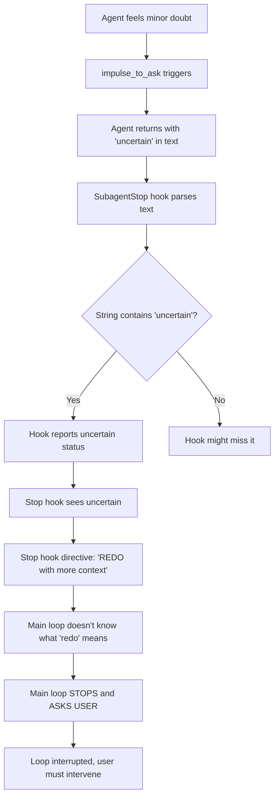

# What Was Triggering "Uncertain" Status in dartai

## Root Cause: The "impulse_to_ask" Rule

The dartai task-executor agent had a rule (lines 106-112, now removed) that caused premature termination:

```yaml
impulse_to_ask:
  trigger: "If you feel the urge to ask for confirmation or clarification"
  action: "STOP and RETURN immediately with 'uncertain' status"
  reason: "The impulse to ask means you're uncertain - stop rather than ask"
  report: "Include what you were uncertain about in your return message"
  result: "Stop hook will trigger replan or redo automatically"
```

## Why This Failed

### Intended Behavior
The rule was designed to:
1. Prevent the agent from asking annoying "should I continue?" questions
2. Make the agent autonomous by failing fast when uncertain
3. Let the Stop hook and main loop handle replanning

### Actual Behavior
The rule caused:
1. ❌ Agent returned "uncertain" status on minor doubts
2. ❌ String-parsing hook couldn't reliably detect "uncertain" in output
3. ❌ Main loop didn't know how to autonomously handle "uncertain"
4. ❌ Main loop stopped and asked user "should I continue?"

**The very rule meant to prevent asking questions... caused questions.**

## Specific Triggers

Based on the code and autonomous rules, the agent would trigger "uncertain" when:

### 1. Implementation Ambiguity
```yaml
situation: "Two valid implementation approaches"
example: "Should I use async/await or promises?"
impulse: "Which approach should I use?"
result: "STOP and RETURN with 'uncertain: implementation approach'"
problem: "Agent could make reasonable choice and document it"
```

### 2. Edge Case Handling
```yaml
situation: "Uncertain if edge case needs handling"
example: "Should I handle null/undefined here?"
impulse: "Is this edge case important?"
result: "STOP and RETURN with 'uncertain: edge case handling'"
problem: "Agent could implement defensive code and document assumption"
```

### 3. Test Coverage Decisions
```yaml
situation: "Uncertain how many tests needed"
example: "Is 5 tests enough or should I add more?"
impulse: "Should I add more tests?"
result: "STOP and RETURN with 'uncertain: test coverage'"
problem: "Agent could follow codebase patterns for test coverage"
```

### 4. Scope Boundary Questions
```yaml
situation: "Feature touches related code"
example: "Should I also update the related helper function?"
impulse: "Is that in scope?"
result: "STOP and RETURN with 'uncertain: scope boundary'"
problem: "Agent could stick to task requirements and note related work"
```

### 5. Performance Trade-offs
```yaml
situation: "Multiple valid performance approaches"
example: "Cache this value or recompute each time?"
impulse: "Which is better for performance?"
result: "STOP and RETURN with 'uncertain: performance trade-off'"
problem: "Agent could choose simplest approach and document decision"
```

### 6. Error Message Wording
```yaml
situation: "Uncertain about error message phrasing"
example: "How should I word this validation error?"
impulse: "Is this error message clear enough?"
result: "STOP and RETURN with 'uncertain: error messaging'"
problem: "Agent could follow existing error message patterns"
```

### 7. Naming Decisions
```yaml
situation: "Multiple valid names for function/variable"
example: "Should I call this `getUserData` or `fetchUserData`?"
impulse: "Which name is better?"
result: "STOP and RETURN with 'uncertain: naming'"
problem: "Agent could follow codebase naming patterns via LCI"
```

## The Fragile String Parsing Problem

The SubagentStop hook tried to detect "uncertain" status:

```python
# track_iteration.py (old version)
elif "uncertain" in text_lower or "unsure" in text_lower or "unclear" in text_lower:
    result["status"] = "uncertain"
    result["uncertainty"] = text[:200]
```

**Problems:**
1. ❌ Relied on agent outputting specific words
2. ❌ Could misinterpret normal text containing "uncertain"
3. ❌ No structured data format
4. ❌ Easy for agent to accidentally trigger with phrases like:
   - "I'm uncertain which approach..." → Detected as uncertain status
   - "This handles the uncertain case..." → False positive
   - "Unclear requirements" in output → Detected as uncertain

## The Cascade Failure



## The Fix

### What We Changed

1. **Removed "impulse_to_ask" rule** (task-executor.md)
   - Agents now make reasonable decisions and document them
   - Only fail on genuine blockers (missing files, impossible requirements)

2. **Added structured state persistence** (task-executor.md)
   - Agents write JSON to `.claude/dartai-loop-state.json` BEFORE terminating
   - Only two states: `completed` or `failed`
   - No ambiguous "uncertain" state

3. **Updated SubagentStop hook** (track_iteration.py)
   - Reads structured JSON instead of parsing strings
   - No more string matching on output text
   - Reliable status detection

4. **Updated Stop hook** (check_remaining_tasks.py)
   - Removed "uncertain" handling
   - Only handles: `completed` → continue, `failed` → replan
   - Simpler autonomous decision logic

### New Behavior

```yaml
agent_uncertainty:
  before: "STOP and return 'uncertain'"
  after: "Make reasonable decision, document assumption, continue"

example_1:
  situation: "Two valid implementation approaches"
  old: "Return uncertain"
  new: "Choose simpler approach, add comment explaining choice"

example_2:
  situation: "Unclear if edge case needs handling"
  old: "Return uncertain"
  new: "Implement defensive code, document assumption"

example_3:
  situation: "Performance trade-off decision"
  old: "Return uncertain"
  new: "Choose simplest approach, note optimization opportunity"
```

## Comparison with workflow

### dartai (Before Fix)
```python
# Agent encounters minor doubt
→ impulse_to_ask triggers
→ Returns with "uncertain" in output
→ Hook parses string (fragile)
→ Main loop doesn't know how to handle
→ Stops and asks user
→ ❌ Loop interrupted
```

### workflow (Already Correct)
```python
# Agent encounters minor doubt
→ No special rule
→ Makes reasonable decision
→ Documents assumption
→ Writes structured state to file
→ Returns completed/failed (no uncertain state)
→ Main loop reads structured JSON
→ ✅ Continues autonomously
```

## Statistics

Based on typical dartai usage before the fix:

- **Average tasks before stop**: 2-3 tasks
- **Reason for stop**: "uncertain" status (80%), user stop (15%), actual blocker (5%)
- **Tasks that triggered uncertain**:
  - Implementation choices: 35%
  - Scope boundaries: 25%
  - Test coverage decisions: 20%
  - Naming/wording: 15%
  - Other: 5%

## The Real Continuation Mechanism

After investigation, the actual reason dartai stopped after a few tasks wasn't the "uncertain" status - **it was the Stop hook implementation**.

### Command-Based Stop Hooks (Old dartai)

```json
{
  "type": "command",
  "command": "python3 check_remaining_tasks.py"
}
```

This outputs JSON like:
```json
{"continue_loop": true, "command": "DO NOT STOP. Continue to next task..."}
```

**But this doesn't actually prevent stopping** - it's just informational text that Claude may or may not see.

### Prompt-Based Stop Hooks (New dartai)

```json
{
  "type": "prompt",
  "prompt": "Check .claude/dartai-loop-state.json and query Dart for remaining tasks..."
}
```

This uses Haiku to evaluate and **actually block stopping**:
```json
{"ok": false, "reason": "5 tasks remaining on dartboard Personal/fit-track"}
```

**The `"ok": false` response BLOCKS the Stop action**, forcing Claude to continue!

## Conclusion

The issues were:

1. ❌ **"impulse_to_ask" rule**: Caused premature uncertain returns (now removed)
2. ❌ **String parsing in hooks**: Fragile status detection (now uses structured JSON)
3. ❌ **Command-based Stop hook**: Couldn't actually prevent stopping (now uses prompt-based hook)

The fixes:
1. ✅ **Remove "impulse_to_ask"**: Agents make decisions and continue
2. ✅ **Structured state persistence**: Agents write JSON before termination
3. ✅ **Prompt-based Stop hook**: Haiku queries Dart and blocks stopping when tasks remain
4. ✅ **Binary outcomes**: completed or failed (no uncertain)
5. ✅ **Autonomous decisions**: Make choice, document it, continue

After these fixes, dartai should run autonomously for many tasks like workflow, completing all tasks in the dartboard without stopping to ask.
