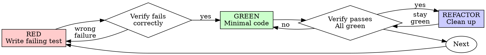

# Test-Driven Development (TDD)

## Overview

先寫測試。觀其敗。次寫最小碼令過。

**Core principle:** 若未觀測試敗，則不知其所測是否得當。

**Violating the letter of the rules is violating the spirit of the rules.**

## When to Use

**Always:**
- New features
- Bug fixes
- Refactoring
- Behavior changes

**Exceptions (ask your human partner):**
- Throwaway prototypes
- Generated code
- Configuration files

念「此番姑略 TDD」？止。此乃自欺 (rationalization)。

## The Iron Law

```
NO PRODUCTION CODE WITHOUT A FAILING TEST FIRST
```

先於測試而寫碼？刪之。重起。

**No exceptions:**
- 勿留為「reference」
- 勿寫測試時「adapt」之
- 勿視之
- Delete means delete

由測試重新實作。Period.

## Red-Green-Refactor



### RED - Write Failing Test

寫一最小測試，明其當然之行為。

<Good>
```typescript
test('retries failed operations 3 times', async () => {
  let attempts = 0;
  const operation = () => {
    attempts++;
    if (attempts < 3) throw new Error('fail');
    return 'success';
  };

  const result = await retryOperation(operation);

  expect(result).toBe('success');
  expect(attempts).toBe(3);
});
```
名清、測真行為、專一事
</Good>

<Bad>
```typescript
test('retry works', async () => {
  const mock = jest.fn()
    .mockRejectedValueOnce(new Error())
    .mockRejectedValueOnce(new Error())
    .mockResolvedValueOnce('success');
  await retryOperation(mock);
  expect(mock).toHaveBeenCalledTimes(3);
});
```
名含糊、測 mock 而非碼
</Bad>

**Requirements:**
- One behavior
- Clear name
- Real code (no mocks unless unavoidable)

### Verify RED - Watch It Fail

**MANDATORY. Never skip.**

```bash
npm test path/to/test.test.ts
```

確認：
- Test fails (not errors)
- Failure message is expected
- Fails because feature missing (not typos)

**Test passes?** 汝所測乃既有行為。修測試。

**Test errors?** 修錯，重跑至其正當而敗。

### GREEN - Minimal Code

寫最簡之碼令測試過。

<Good>
```typescript
async function retryOperation<T>(fn: () => Promise<T>): Promise<T> {
  for (let i = 0; i < 3; i++) {
    try {
      return await fn();
    } catch (e) {
      if (i === 2) throw e;
    }
  }
  throw new Error('unreachable');
}
```
恰足以過
</Good>

<Bad>
```typescript
async function retryOperation<T>(
  fn: () => Promise<T>,
  options?: {
    maxRetries?: number;
    backoff?: 'linear' | 'exponential';
    onRetry?: (attempt: number) => void;
  }
): Promise<T> {
  // YAGNI
}
```
過度工程
</Bad>

勿添功能、勿重構他碼、勿越測試而「improve」。

### Verify GREEN - Watch It Pass

**MANDATORY.**

```bash
npm test path/to/test.test.ts
```

確認：
- Test passes
- Other tests still pass
- Output pristine (no errors, warnings)

**Test fails?** 修碼，非修測試。

**Other tests fail?** 即修之。

### REFACTOR - Clean Up

唯 green 後：
- Remove duplication
- Improve names
- Extract helpers

保測試 green。勿添行為。

### Repeat

次一測試，測次一功能。

## Good Tests

| Quality | Good | Bad |
|---------|------|-----|
| **Minimal** | 專一事。名含「and」？分之。 | `test('validates email and domain and whitespace')` |
| **Clear** | 名述行為 | `test('test1')` |
| **Shows intent** | 顯所欲之 API | 晦碼之當然 |

## Why Order Matters

**"I'll write tests after to verify it works"**

碼後所寫之測試即刻即過。即刻過者證無所證：
- Might test wrong thing
- Might test implementation, not behavior
- Might miss edge cases you forgot
- You never saw it catch the bug

Test-first 迫汝觀測試敗，證其確有所測。

**"I already manually tested all the edge cases"**

Manual testing 乃臨時 (ad-hoc)。汝以為盡測，然：
- No record of what you tested
- Can't re-run when code changes
- Easy to forget cases under pressure
- "It worked when I tried it" ≠ comprehensive

Automated tests 乃系統性。每次同法而跑。

**"Deleting X hours of work is wasteful"**

Sunk cost fallacy。時已逝。汝今之擇：
- Delete and rewrite with TDD (X more hours, high confidence)
- Keep it and add tests after (30 min, low confidence, likely bugs)

「Waste」者，乃留不可信之碼。無真測之可行碼即 technical debt。

**"TDD is dogmatic, being pragmatic means adapting"**

TDD IS pragmatic:
- Finds bugs before commit (faster than debugging after)
- Prevents regressions (tests catch breaks immediately)
- Documents behavior (tests show how to use code)
- Enables refactoring (change freely, tests catch breaks)

「Pragmatic」捷徑 = debugging in production = slower。

**"Tests after achieve the same goals - it's spirit not ritual"**

No. Tests-after 答「What does this do?」Tests-first 答「What should this do?」

Tests-after 為汝實作所偏。汝測所建，非所需。汝驗所憶之 edge cases，非所發現者。

Tests-first 迫 edge case discovery 於實作之前。Tests-after 驗汝盡憶 (汝未也)。

30 分鐘之事後測試 ≠ TDD。得 coverage，失測試有效之證。

## Common Rationalizations

| Excuse | Reality |
|--------|---------|
| "Too simple to test" | Simple code breaks. Test takes 30 seconds. |
| "I'll test after" | Tests passing immediately prove nothing. |
| "Tests after achieve same goals" | Tests-after = "what does this do?" Tests-first = "what should this do?" |
| "Already manually tested" | Ad-hoc ≠ systematic. No record, can't re-run. |
| "Deleting X hours is wasteful" | Sunk cost fallacy. Keeping unverified code is technical debt. |
| "Keep as reference, write tests first" | You'll adapt it. That's testing after. Delete means delete. |
| "Need to explore first" | Fine. Throw away exploration, start with TDD. |
| "Test hard = design unclear" | Listen to test. Hard to test = hard to use. |
| "TDD will slow me down" | TDD faster than debugging. Pragmatic = test-first. |
| "Manual test faster" | Manual doesn't prove edge cases. You'll re-test every change. |
| "Existing code has no tests" | You're improving it. Add tests for existing code. |

## Red Flags - STOP and Start Over

- Code before test
- Test after implementation
- Test passes immediately
- Can't explain why test failed
- Tests added "later"
- Rationalizing "just this once"
- "I already manually tested it"
- "Tests after achieve the same purpose"
- "It's about spirit not ritual"
- "Keep as reference" or "adapt existing code"
- "Already spent X hours, deleting is wasteful"
- "TDD is dogmatic, I'm being pragmatic"
- "This is different because..."

**All of these mean: Delete code. Start over with TDD.**

## Example: Bug Fix

**Bug:** Empty email accepted

**RED**
```typescript
test('rejects empty email', async () => {
  const result = await submitForm({ email: '' });
  expect(result.error).toBe('Email required');
});
```

**Verify RED**
```bash
$ npm test
FAIL: expected 'Email required', got undefined
```

**GREEN**
```typescript
function submitForm(data: FormData) {
  if (!data.email?.trim()) {
    return { error: 'Email required' };
  }
  // ...
}
```

**Verify GREEN**
```bash
$ npm test
PASS
```

**REFACTOR**
按需為多欄位 extract validation。

## Verification Checklist

標記工作完成之前：

- [ ] Every new function/method has a test
- [ ] Watched each test fail before implementing
- [ ] Each test failed for expected reason (feature missing, not typo)
- [ ] Wrote minimal code to pass each test
- [ ] All tests pass
- [ ] Output pristine (no errors, warnings)
- [ ] Tests use real code (mocks only if unavoidable)
- [ ] Edge cases and errors covered

不能盡勾？汝略 TDD 矣。重起。

## When Stuck

| Problem | Solution |
|---------|----------|
| Don't know how to test | Write wished-for API. Write assertion first. Ask your human partner. |
| Test too complicated | Design too complicated. Simplify interface. |
| Must mock everything | Code too coupled. Use dependency injection. |
| Test setup huge | Extract helpers. Still complex? Simplify design. |

## Debugging Integration

得 bug？寫 failing test 復現之。行 TDD cycle。測試證修復並防退化 (regression)。

Never fix bugs without a test. 見 `systematic-debugging`。

## Testing Anti-Patterns

添 mocks 或 test utilities 時，讀 [testing-anti-patterns.md](testing-anti-patterns.md) 以避常見陷阱：
- Testing mock behavior instead of real behavior
- Adding test-only methods to production classes
- Mocking without understanding dependencies

## Final Rule

```
Production code → test exists and failed first
Otherwise → not TDD
```

No exceptions without your human partner's permission.
